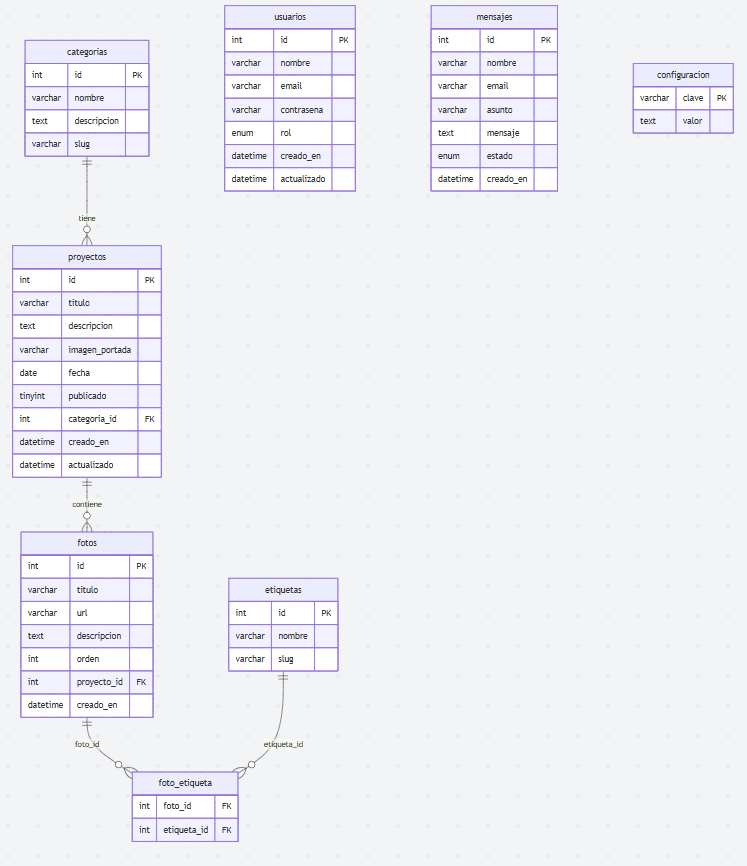
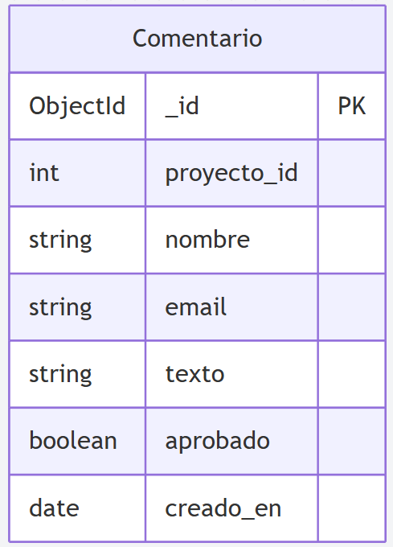

# Eneas Menéndez Photography — Portfolio

Aplicación web full-stack desarrollada con **Next.js 15** que sirve como portfolio fotográfico profesional. Permite gestionar proyectos, galerías de fotos, mensajes de contacto y comentarios de visitantes a través de un panel de administración completo.

## Anotaciones

La base de este proyecto está basada en el TFC (Trabajo fin de Ciclo), más simplificado y con otras tecnologías.
No es una versión definitiva ni completamente funcional por posibles errores de seguridad o estilos de programación.
Proyecto escalable para ser un porfolio personal sobre mi otro sector profesional.


### Usuarios de prueba (Se pueden crear más dentro de la aplicación)

| Email | Contraseña | Rol |
|---|---|---|
| admin@portfolio.com | admin1234 | ADMIN |
| elena@portfolio.com | editor1234 | EDITOR |
| carlos@portfolio.com | carlos1234 | EDITOR |
---

### Parte pública
- **Página de inicio** con hero configurable (imagen de fondo y color con opacidad desde el panel admin) y proyectos destacados.
- **Catálogo de proyectos** con filtros por categoría y año, paginación y búsqueda.
- **Detalle de proyecto** con galería de fotos interactiva (lightbox) y sección de comentarios.
- **Sobre mí** con descripción personal, habilidades y datos de contacto.
- **Formulario de contacto** con validación y protección anti-spam.

### Panel de administración (`/dashboard`)
- Gestión completa CRUD de **proyectos**, **fotos**, **categorías** y **usuarios**.
- **Vista previa de borradores** antes de publicar (`/preview/[id]`).
- Bandeja de entrada de **mensajes de contacto** con estados (nuevo / leído / respondido).
- Moderación de **comentarios** MongoDB (aprobar / rechazar / eliminar) con filtros.
- **Ajustes del hero**: selector de color con opacidad y URL de imagen de fondo, persistidos en base de datos.
- Soporte de **roles**: `ADMIN` (acceso total) y `EDITOR` (sin gestión de usuarios).

### Funcionalidades técnicas
- Conversión automática de URLs de **Google Drive** al formato thumbnail (`/thumbnail?id=…&sz=w2000`).
- **Caché de consultas** en servidor con `unstable_cache` y revalidación por etiquetas.
- **Rate limiting** en memoria para comentarios (5/hora), mensajes de contacto (3/hora) y login (5/15 min).
- **Protección CSRF** por validación de cabecera `Origin`.
- **Lightbox** en galerías con navegación por teclado y pantalla completa.
- **Bootstrap 5** instalado como paquete npm (sin CDN).

---
## Listado de rutas

```
ProyectoFinalReact/
├── app/
│   ├── page.js                        # Inicio (hero + proyectos destacados)
│   ├── proyectos/
│   │   ├── page.js                    # Catálogo con filtros
│   │   └── [id]/
│   │       ├── page.js                # Detalle + galería + comentarios
│   │       └── GaleriaLightbox.js     # Componente cliente lightbox
│   ├── preview/[id]/page.js           # Vista previa de borradores (admin)
│   ├── sobre-mi/page.js
│   ├── contacto/page.js
│   ├── login/page.js
│   ├── dashboard/page.js
│   ├── admin/
│   │   ├── proyectos/                 # CRUD proyectos
│   │   ├── fotos/                     # CRUD fotos
│   │   ├── categorias/                # CRUD categorías
│   │   ├── usuarios/                  # CRUD usuarios (solo ADMIN)
│   │   ├── mensajes/                  # Bandeja de mensajes
│   │   ├── comentarios/               # Moderación de comentarios MongoDB
│   │   └── ajustes/page.js            # Hero color + imagen
│   └── api/
│       ├── auth/login/                # POST — inicio de sesión
│       ├── auth/logout/               # POST — cierre de sesión
│       ├── me/                        # GET — sesión activa
│       ├── proyectos/                 # GET, POST
│       ├── proyectos/[id]/            # GET, PUT, DELETE
│       ├── fotos/                     # GET, POST
│       ├── fotos/[id]/                # GET, PUT, DELETE
│       ├── categorias/                # GET, POST
│       ├── categorias/[id]/           # PUT, DELETE
│       ├── usuarios/                  # GET, POST
│       ├── usuarios/[id]/             # PUT, DELETE
│       ├── mensajes/                  # GET, POST
│       ├── mensajes/[id]/             # PUT, DELETE
│       ├── comentarios/               # GET (público/admin), POST (público)
│       ├── comentarios/[id]/          # PUT toggle aprobado, DELETE (admin)
│       ├── config/                    # GET, PUT — ajustes del hero
│       ├── dashboard/                 # GET — estadísticas
│       └── setup/                     # GET — inicialización de tablas
├── components/
│   ├── NavBar.js                      # Navegación pública y admin
│   ├── Contenedor.js                  # Wrapper Bootstrap container
│   ├── ImagenPortada.js               # Imagen 3:2 con object-fit
│   ├── InputImagenUrl.js              # Input con previsualización en vivo
│   ├── SeccionComentarios.js          # Formulario + lista de comentarios
│   └── BootstrapBundle.js             # Carga JS de Bootstrap en cliente
├── lib/
│   ├── mysql.js                       # Conexión Sequelize + modelos SQL
│   ├── mongodb.js                     # Conexión Mongoose (HMR-safe)
│   ├── auth.js                        # Gestión de sesión
│   ├── csrf.js                        # Validación CSRF por Origin
│   ├── rateLimit.js                   # Rate limiter en memoria
│   ├── imagenUrl.js                   # Conversión URLs Google Drive
│   └── models/
│       └── Comentario.js              # Schema Mongoose de comentarios
├── scripts/
│   ├── setup.js                       # Crea tablas SQL si no existen
│   └── portfolio_fotografia.sql       # Script completo con datos de prueba
├── middleware.js                      # Protección de rutas /admin, /dashboard, /preview
├── next.config.js
└── .env.local                         # Variables de entorno (no subir a git)
```

---

## Instalación

```bash
# 1. Clonar el repositorio
git clone <https://github.com/EneasMenendez/DWES.git>
cd ProyectoFinalReact

# 2. Instalar dependencias
npm install

# 3. Configurar variables de entorno
cp .env.local.example .env.local
# Editar .env.local con los valores reales

# 4. Iniciar en desarrollo (crea las tablas automáticamente)
npm run dev
```

> Las tablas SQL se crean automáticamente al arrancar gracias al script `scripts/setup.js`, que se ejecuta antes de cada `dev` y `build`.

## Base de datos

### MariaDB — diagrama entidad-relación



### MariaDB — script de datos de prueba

El fichero `scripts/portfolio_fotografia.sql` contiene el esquema completo y datos de prueba listos para importar:

```bash
# Importar desde la línea de comandos
mysql -u root -p < scripts/portfolio_fotografia.sql

# O desde HeidiSQL: Archivo → Ejecutar script SQL
```

El script inserta: 5 categorías, 8 proyectos (6 publicados + 2 borradores), 27 fotos, 8 etiquetas, 3 usuarios y 5 mensajes de contacto.

### MongoDB — inicialización automática

La base de datos `portfolio` y la colección `comentarios` se crean automáticamente al insertar el primer comentario. No requiere configuración adicional.


---

## Ejecución

## En local

```bash
# Desarrollo (con recarga en caliente)
npm run dev

# Producción
npm run build
npm start
```

La aplicación estará disponible en `http://localhost:3000`.

## En Vercel

---

## API REST

Todas las rutas de escritura requieren cabecera `Content-Type: application/json`. Las rutas de administración requieren sesión activa (cookie de autenticación).

### Autenticación

| Método | Ruta | Descripción |
|---|---|---|
| `POST` | `/api/auth/login` | Inicia sesión. Body: `{ email, password }` |
| `POST` | `/api/auth/logout` | Cierra la sesión activa |
| `GET` | `/api/me` | Devuelve los datos del usuario autenticado |

### Proyectos

| Método | Ruta | Auth | Descripción |
|---|---|---|---|
| `GET` | `/api/proyectos` | No | Lista proyectos publicados (con filtros opcionales) |
| `POST` | `/api/proyectos` | Sí | Crea un nuevo proyecto |
| `GET` | `/api/proyectos/[id]` | No | Detalle de un proyecto |
| `PUT` | `/api/proyectos/[id]` | Sí | Actualiza un proyecto |
| `DELETE` | `/api/proyectos/[id]` | Sí | Elimina un proyecto |

### Fotos

| Método | Ruta | Auth | Descripción |
|---|---|---|---|
| `GET` | `/api/fotos` | No | Lista fotos (filtrable por `?proyecto=id`) |
| `POST` | `/api/fotos` | Sí | Añade una foto |
| `PUT` | `/api/fotos/[id]` | Sí | Actualiza una foto |
| `DELETE` | `/api/fotos/[id]` | Sí | Elimina una foto |

### Categorías

| Método | Ruta | Auth | Descripción |
|---|---|---|---|
| `GET` | `/api/categorias` | No | Lista todas las categorías |
| `POST` | `/api/categorias` | Sí | Crea una categoría |
| `PUT` | `/api/categorias/[id]` | Sí | Actualiza una categoría |
| `DELETE` | `/api/categorias/[id]` | Sí | Elimina una categoría |

### Comentarios (MongoDB)

| Método | Ruta | Auth | Descripción |
|---|---|---|---|
| `GET` | `/api/comentarios?proyecto=id` | No* | Lista comentarios. Público: solo aprobados. Admin: todos |
| `POST` | `/api/comentarios` | No | Envía un comentario (pendiente de aprobación) |
| `PUT` | `/api/comentarios/[id]` | Sí | Alterna el estado aprobado/rechazado |
| `DELETE` | `/api/comentarios/[id]` | Sí | Elimina un comentario |

*Sin sesión devuelve solo los comentarios con `aprobado: true`.

### Mensajes de contacto

| Método | Ruta | Auth | Descripción |
|---|---|---|---|
| `GET` | `/api/mensajes` | Sí | Lista todos los mensajes |
| `POST` | `/api/mensajes` | No | Envía un mensaje de contacto |
| `PUT` | `/api/mensajes/[id]` | Sí | Actualiza el estado del mensaje |
| `DELETE` | `/api/mensajes/[id]` | Sí | Elimina un mensaje |

### Configuración del hero

| Método | Ruta | Auth | Descripción |
|---|---|---|---|
| `GET` | `/api/config?clave=hero_color` | No | Lee un valor de configuración |
| `PUT` | `/api/config` | Sí | Guarda `hero_color` y/o `hero_imagen` |

---

## Panel de administración

Acceder en `/login` con cualquiera de los usuarios de prueba.

| Ruta | Rol requerido | Descripción |
|---|---|---|
| `/dashboard` | EDITOR+ | Estadísticas generales |
| `/admin/proyectos` | EDITOR+ | Listado + CRUD + vista previa |
| `/admin/fotos` | EDITOR+ | Listado + CRUD |
| `/admin/categorias` | EDITOR+ | Listado + CRUD |
| `/admin/mensajes` | EDITOR+ | Bandeja de entrada |
| `/admin/comentarios` | EDITOR+ | Moderación de comentarios MongoDB |
| `/admin/ajustes` | EDITOR+ | Color e imagen del hero |
| `/admin/usuarios` | ADMIN | Gestión de usuarios |

### Vista previa de borradores

Los proyectos no publicados se pueden previsualizar en `/preview/[id]` antes de publicarlos. Esta ruta está protegida por middleware y solo es accesible con sesión activa.

---

## Seguridad

### Autenticación
Las contraseñas se almacenan hasheadas con **scrypt** (función de derivación de clave resistente a fuerza bruta). Las sesiones se mantienen mediante una cookie `HttpOnly` firmada con `AUTH_SECRET`.
```js
// lib/csrf.js
export function checkCsrf(request) {
  const origin = request.headers.get('origin');
  if (!origin) return true; // petición server-side
  const { origin: expected } = new URL(request.url);
  return origin === expected;
}
```

### Rate Limiting
Limitación de peticiones en memoria para prevenir abusos:

| Endpoint | Límite |
|---|---|
| `POST /api/auth/login` | 5 intentos / 15 minutos por IP |
| `POST /api/mensajes` | 3 mensajes / hora por IP |
| `POST /api/comentarios` | 5 comentarios / hora por IP |

### Middleware de rutas
El fichero `middleware.js` protege automáticamente todas las rutas `/admin/*`, `/dashboard` y `/preview/*`, redirigiendo a `/login` si no hay sesión activa.

### Moderación de contenido
Los comentarios enviados por visitantes quedan en estado `aprobado: false` hasta que el administrador los revise. Solo los comentarios aprobados son visibles públicamente.

---
